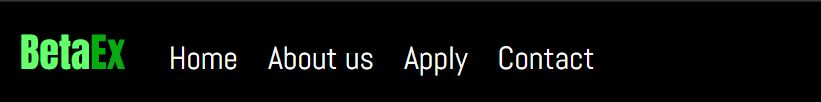
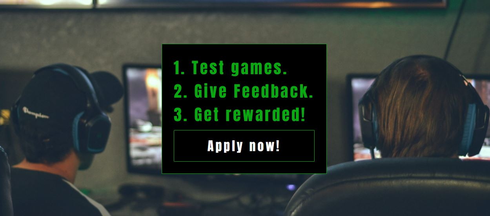
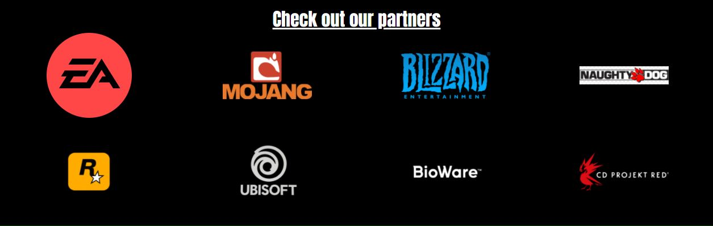
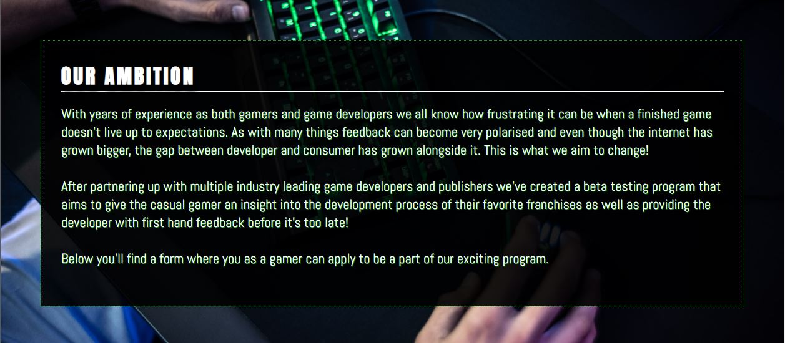
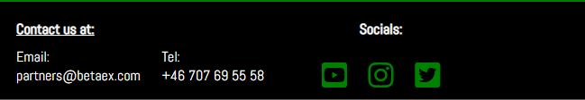
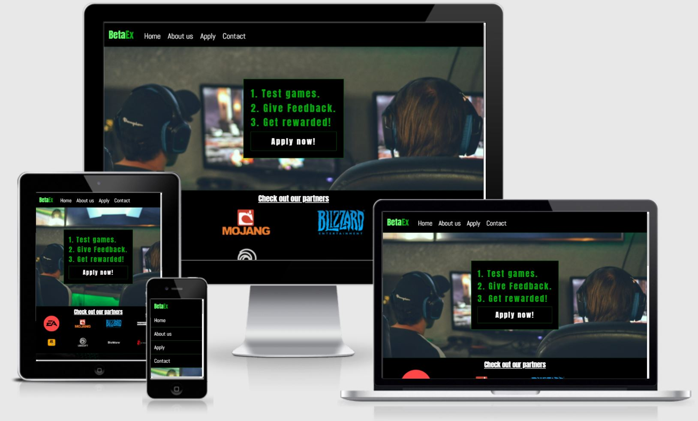
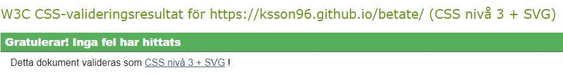
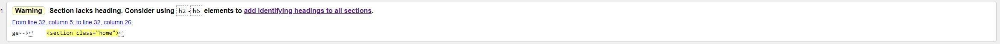
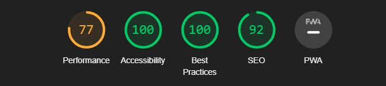

# BetaEx

BetaEx is an sign up portal for the casual gamer looking to apply to a beta testing program in collaboration with game studios in order to provide game developers with sufficient feedback for the development of their upcoming games. In return, applicants will be rewarded with redeemable game codes.

## Table of Contents

1. [UX](#ux)
    - [User Stories](#user-stories)
    - [Design Choices](#design-choices)

2. [Features](#features)
    - [Content](#content)
    - [Responsiveness](#responsiveness)

3. [Technologies](#technologies)
    - [Languages](#languages)
    - [Testing](#testing)
    - [Bugs](#bugs)

4. [Deployment](#deployment)

5. [Credits](#credits) 

# UX

### Project Goals
The final idea was to create a fully responsive and easy to navigate platform where gamers could apply to be part of a game testing program with a site that gives a clear description of the purpose behind it.

### User Stories
- As a User I want to be able to see what game studios I will be testing games for.
- As a User I want an easy way to find contact details in order to join the program as a game developer.
- As a User I want to quickly be able to navigate to the application form.

### Design Choices

#### Fonts

The fonts used are Abel & Anton. 

Anton was used for the headings since it worked well with single word use as the general thickness was quite high which made it stand out.

Abel however was primarily used for longer paragraphs of text alongisde the navigation menu and the form to keep those areas less cluttered. 

#### Colours

The idea was to make a site that resonates with gamers and therefore the primary colours were white (#fff) text and light green (#07aa0f) borders on a black (#000) background. 
Some darker variations of (#07aa0f) were used for borders in order to create a sense of depth on around some of the sections.

# Features

## Content

### Header
The Header displays the site logo alongside a navigation menu including links to all parts of the page.

### Home
The Home Page gives a brief rundown of the steps included after being accepted as well as an additional link to the application form.

### Partners
The Partners sections displays a list of logos representing the various game companies that are a part of the program.

### About us
The About us page gives gamers aswell as game developers additional information of the reasoning and purpose behind the website.

### Footer
The Footer consists of contact information for game companies aswell as links to various social media plattforms.

 
 ## Responsiveness
 The website is fully responsive for small, medium and large screen sizes.

 
# Technologies

## Languages:
- HTML
- CSS

### Testing
- On use, the website is fully responsive and all links are working.

#### Validation

- Jigsaw W3C Validtor (CSS) - Returned no errors

- W3C Markup Validator (HTML) - Returned 1 Warning

- Lighthouse

### Bugs
- No know bugs at the moment of deployment

# Deployment
- The site was deployed to GitHub pages.
- In github repository, go to settings.
- Select master branch as source location. 
- Press the provided link
- Site is accessible via [BetaEx](https://ksson96.github.io/betate/)

# Credits
- Credit goes to my newfound understanding of the concepts covered in this project.
